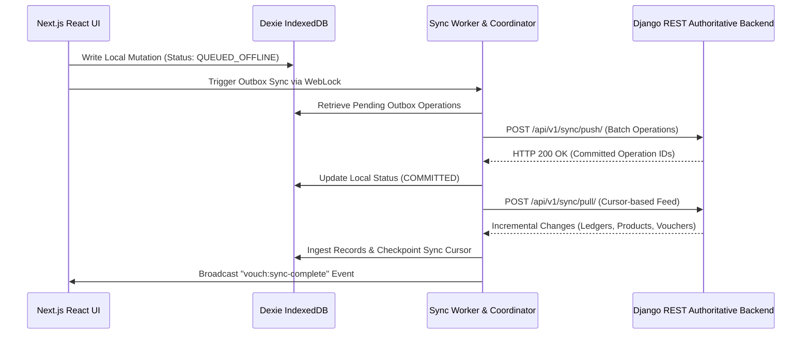

# Vouch Architecture, Security & System Design

## 1. Multi-Tenant Security & Role-Based Access Control (RBAC)

Vouch enforces multi-tenancy at both the gateway and the database query layers. A single user can belong to multiple companies with different roles across each workspace.

### Role Hierarchy & Capability Matrix
| Role | Sales & Invoicing | Purchase Bills | Multi-Line Journals | Contra Transfers | Cancel / Delete Vouchers | Company Settings |
| :--- | :---: | :---: | :---: | :---: | :---: | :---: |
| **OWNER** | Allowed | Allowed | Allowed | Allowed | Allowed | Allowed |
| **ADMIN** | Allowed | Allowed | Allowed | Allowed | Allowed | Allowed |
| **CA** | Allowed | Allowed | Allowed | Allowed | Allowed | Read-Only |
| **EMPLOYEE** | Allowed | Allowed | Denied | Denied | Denied | Denied |
| **VIEWER** | Denied | Denied | Denied | Denied | Denied | Denied |

### Backend Enforcement
- **`apps/accounts/permissions.py`**:
  - `BaseCompanyPermission` extracts and verifies tenant boundaries (`X-Company-ID` header, request body, query params, or URL kwargs) ensuring requests cannot cross company partitions.
  - `CanCreateJournal` limits manual double-entry ledger interventions to `['ADMIN', 'OWNER', 'CA']`.
  - `CanPostVoucher` allows structured transactions for billing operators while maintaining audit boundaries.
- **`UniversalVoucherAPIView`**:
  - Validates `voucher_type`: whenever `JOURNAL` or `CONTRA` operations are submitted, the backend verifies that the acting user has `OWNER`, `ADMIN`, or `CA` permissions for the target company. Unauthorized attempts return HTTP 403 Forbidden.

### Session Lifecycle & Safe Navigation
- **Token Expiry Preemption**: Tokens are checked with a 10-second skew buffer to preempt edge-of-expiry network races.
- **Back-Button Loop Prevention**: On session expiration or rejection, redirect utilizes `window.location.replace('/login?expired=1')` rather than `.href`, eliminating expired pages from the browser history stack.
- **Request Loop Guard**: Telemetry tracks request velocity and triggers proactive loop detection if duplicate endpoint bursts exceed thresholds.

---

## 2. Offline-First System Design & Sync Protocol

Vouch implements an offline-first architecture powered by Dexie (IndexedDB), Web Workers, and a CRDT Operational Log (`ClientOperationManager`).

### Key Guarantees
- **Multi-Tab Concurrency**: Coordinated via `navigator.locks.request("vouch_sync_coordinator_lock")` and cross-tab `BroadcastChannel("vouch_local_sync")`.
- **Atomic Read Model Ingestion**: When a voucher is posted online, `ingestVoucherLocally` synchronously writes the entity to IndexedDB before page navigation occurs, ensuring zero perceived lag.
- **Idempotent Cursor Replay**: Pull feeds accept high-watermark timestamps and continuous cursor pagination, guaranteeing at-least-once delivery with deduplication on primary keys.

---

## 3. UI/UX Accessibility & Keyboard Navigation

The user interface follows WCAG AA accessibility standards and keyboard-first accounting workflows:

- **Modal Dialog Semantics**: `UniversalNewModal` implements `role="dialog"`, `aria-modal="true"`, and `aria-labelledby="universal-new-title"`.
- **Focus Trapping**: Tab and Shift+Tab key presses cycle strictly within modal boundaries. The initial actionable element receives focus upon modal mount, and `Escape` dismisses the modal cleanly.
- **Screen Reader Clarity**: All action buttons feature descriptive `aria-label` attributes incorporating hotkey hints (e.g., `aria-label="Create Sales Invoice (Shortcut: F8)"`).
- **Navbar Layout Protection**: Navbar controls (Company Switcher, FY selector, Command Palette, Calculator, Profile) utilize `aria-haspopup` and `aria-expanded` attributes, with fixed-minimum hit-areas (`min-h-[36px]`) and overflow protections.
- **Role Awareness**: If an account holds `VIEWER` permissions, creation dialogs immediately surface view-only alert banners and disable modifying actions to prevent operator frustration.
