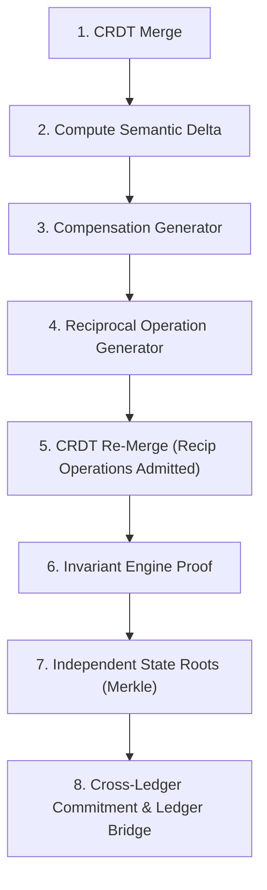

# Patent Specification: Semantic Delta & Automated Compensation
**Invention:** Deterministic Reconciliation and Reciprocal Accounting Derivation  
**Domain:** Cross-Enterprise Distributed Dispute Resolution / Double-Entry Balancing

---

## 1. Technical Motivation

In real-world commerce, discrepancies between trading partners are not simple data conflicts; they represent economic events:
- A buyer physically rejects damaged units upon delivery.
- A buyer renegotiates unit pricing due to delayed fulfillment.
- A seller issues a volume rebate or correction.

In traditional EDI, when a buyer disputes an invoice, the transaction halts. Manual human accountants must exchange emails, agree on numbers, manually raise a Credit Note on the seller's ERP, and manually raise a Debit Note on the buyer's ERP. This process takes 7–30 days and frequently introduces ledger discrepancies.

The present invention solves this problem by defining an automated, deterministic function that transforms semantic divergence into reciprocal, double-entry balanced operations:
$$\mathcal{C}_{\text{recip}} = \mathcal{F}(\Delta_{\text{semantic}}, \mathcal{T}_{\text{canonical}}, \mathcal{R}_{\text{accounting}})$$

---

## 2. Semantic Delta Calculus

Given two states $\mathcal{S}_{\text{local}}$ and $\mathcal{S}_{\text{remote}}$, the Semantic Delta Engine calculates the element-wise divergence:

$$\Delta = \langle \Delta_{\text{qty}}, \Delta_{\text{taxable}}, \Delta_{\text{tax}}, \Delta_{\text{grand\_total}} \rangle$$

Where:
$$\Delta_{\text{qty}}(l) = q_{\text{accepted}}(l) - q_{\text{invoiced}}(l)$$
$$\Delta_{\text{taxable}}(l) = \text{Taxable}_{\text{accepted}}(l) - \text{Taxable}_{\text{invoiced}}(l)$$

---

## 3. Automated Reciprocal Compensation Pipeline

The reconciliation pipeline does not simply flag a difference; it automatically generates balanced compensating entries through an atomic 6-step pipeline:

### 3.1. Case A: Item Rejection (Goods Return)
When a buyer submits an `ITEM_REJECTED` operation for quantity $q_r$:
1. **Local Buyer Operation:**
   $$\mathcal{O}_{\text{reject}} \to \text{Reduces Accounts Payable}, \text{Reduces Purchase Expense}, \text{Reduces Input GST}$$
2. **Derived Reciprocal Seller Operation:**
   $$\mathcal{O}_{\text{credit\_note}} = \text{CompensationEngine.generate\_reciprocal\_seller\_credit\_note}(\mathcal{O}_{\text{reject}})$$
   - Declares explicit causal parent: $\text{parents}(\mathcal{O}_{\text{credit\_note}}) = [\text{ID}(\mathcal{O}_{\text{reject}})]$
   - Deterministic seed ensures identical hash regardless of which node computes it:
     $$\text{ID} = H(\text{TxID} \parallel \text{ID}(\mathcal{O}_{\text{reject}}) \parallel \text{"RECIPROCAL\_CREDIT\_NOTE"})$$
   - Generates Credit Note in Seller's ledger: reduces Accounts Receivable, reduces Sales Revenue, reduces Output GST liability, and returns $q_r$ back into Seller inventory stock.

### 3.2. Case B: Price Adjustment
When counterparties agree on a unit price change from $P_{\text{old}}$ to $P_{\text{new}}$:
- If $P_{\text{new}} < P_{\text{old}}$: Automatically generates reciprocal `CREDIT_NOTE_ISSUED` (price reduction).
- If $P_{\text{new}} > P_{\text{old}}$: Automatically generates reciprocal `DEBIT_NOTE_ISSUED` (supplementary invoice charge).

---

## 4. Authoritative Tax Component Invariant

The compensation engine delegates directly to Vouch's authoritative GST calculation rules:
- Intra-state transaction ($\text{State}_{\text{seller}} == \text{State}_{\text{buyer}}$):
  $$\text{CGST} = \text{round}\left(\frac{\Delta_{\text{taxable}} \times r_{\text{gst}}}{200}, 2\right), \quad \text{SGST} = \text{CGST}, \quad \text{IGST} = 0$$
- Inter-state transaction ($\text{State}_{\text{seller}} \ne \text{State}_{\text{buyer}}$):
  $$\text{IGST} = \text{round}\left(\frac{\Delta_{\text{taxable}} \times r_{\text{gst}}}{100}, 2\right), \quad \text{CGST} = 0, \quad \text{SGST} = 0$$

Under this mechanism, neither party can unilaterally distort tax liabilities or round-off paise. Both ledgers converge to exact, mathematically proved double-entry equality.
