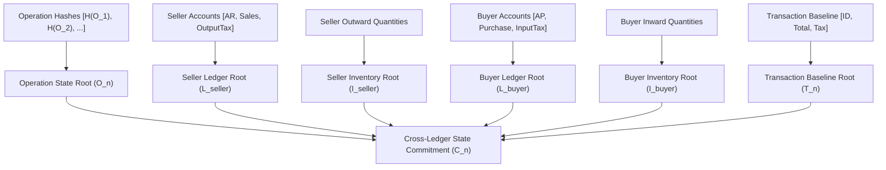

# Patent Specification: State Roots & Cryptographic Commitments
**Invention:** 4-Way Independent Merkle State Roots and Dual Asymmetric Cross-Ledger Commitments  
**Classification:** Applied Cryptography / Distributed Ledger Technology / Non-Repudiation Systems

---

## 1. Technical Problem: Unilateral Ledger Mutation & Privacy

In distributed commerce, two major security and trust dilemmas exist:
1. **Unilateral Database Tampering:** A malicious supplier or rogue accountant can edit historical relational database rows (e.g. changing an invoice total from ₹10,000 to ₹12,000), leaving the buyer with conflicting records.
2. **Privacy vs. Proof:** Public blockchains solve tampering by publishing all ledger movements to every peer on a network. However, MSMEs and private enterprises cannot expose their confidential margins, vendor names, or inventory levels on a shared public ledger.

---

## 2. Technical Solution: Independent 4-Way Merkle Subsystem Roots

The present invention computes localized, independent Merkle trees for each discrete business subsystem without sharing raw ledger entries:

### 2.1. Merkle Tree Formulation
Each subsystem $K \in \{ \text{Op}, \text{SL}, \text{SI}, \text{BL}, \text{BI}, \text{Tx} \}$ constructs a balanced binary Merkle tree:
$$\text{Leaf}_i = H(\text{CanonicalString}_i)$$
$$\text{Parent}_{j} = H(\text{LeftChild} \parallel \text{RightChild})$$
$$\text{Root}_K = \text{TopNode of Tree } K$$

---

## 3. The Cross-Ledger State Commitment ($C_n$)

The final cryptographic commitment $C_n$ binds the entire multidimensional state into an immutable 256-bit hash:

$$C_n = H\Big(T_n \parallel O_n \parallel L_{\text{seller}} \parallel I_{\text{seller}} \parallel L_{\text{buyer}} \parallel I_{\text{buyer}} \parallel S_n \parallel B_n \parallel C_{n-1} \parallel V_n\Big)$$

Where:
- $T_n$: Transaction Baseline Root
- $O_n$: Operation State Root (hashes of all causal operations)
- $L_{\text{seller}}, I_{\text{seller}}$: Seller's independent ledger and stock state roots
- $L_{\text{buyer}}, I_{\text{buyer}}$: Buyer's independent reciprocal ledger and stock state roots
- $S_n, B_n$: Counterparty legal identity identifiers (GSTIN / PAN)
- $C_{n-1}$: Previous block commitment hash (forming an immutable cryptographic chain)
- $V_n$: State version integer

---

## 4. Dual Asymmetric Counter-Signing & Fail-Closed Verification

Unlike single-signature blockchain transactions or unsigned database records, a Vouch commitment requires dual asymmetric counter-signatures:

$$\sigma_{\text{seller}} = \text{Ed25519\_Sign}(C_n, \text{PrivKey}_{\text{seller}})$$
$$\sigma_{\text{buyer}} = \text{Ed25519\_Sign}(C_n, \text{PrivKey}_{\text{buyer}})$$

### 4.1. Verification Criteria
To achieve `COMMITTED` status and unlock Ledger Bridge execution:
1. $\text{Ed25519\_Verify}(C_n, \sigma_{\text{seller}}, \text{PubKey}_{\text{seller}}) == \text{True}$
2. $\text{Ed25519\_Verify}(C_n, \sigma_{\text{buyer}}, \text{PubKey}_{\text{buyer}}) == \text{True}$
3. $\text{KeyManager.is\_valid}(\text{PubKey}_{\text{seller}}) \land \text{KeyManager.is\_valid}(\text{PubKey}_{\text{buyer}})$ (keys are active, unexpired, and not on revocation list)

### 4.2. Tamper Evident Proof (Merkle Inclusion)
Any auditor or court of law can verify the inclusion of any specific line item, rejection, or payment $\mathcal{O}_k$ using an $O(\log N)$ Merkle audit path:
$$\text{VerifyProof}(\mathcal{O}_k, \text{Path}_k, O_n) == \text{True}$$
If any historical operation is modified or deleted by even 1 bit, the Merkle root changes completely, instantly invalidating the cryptographic commitment.
