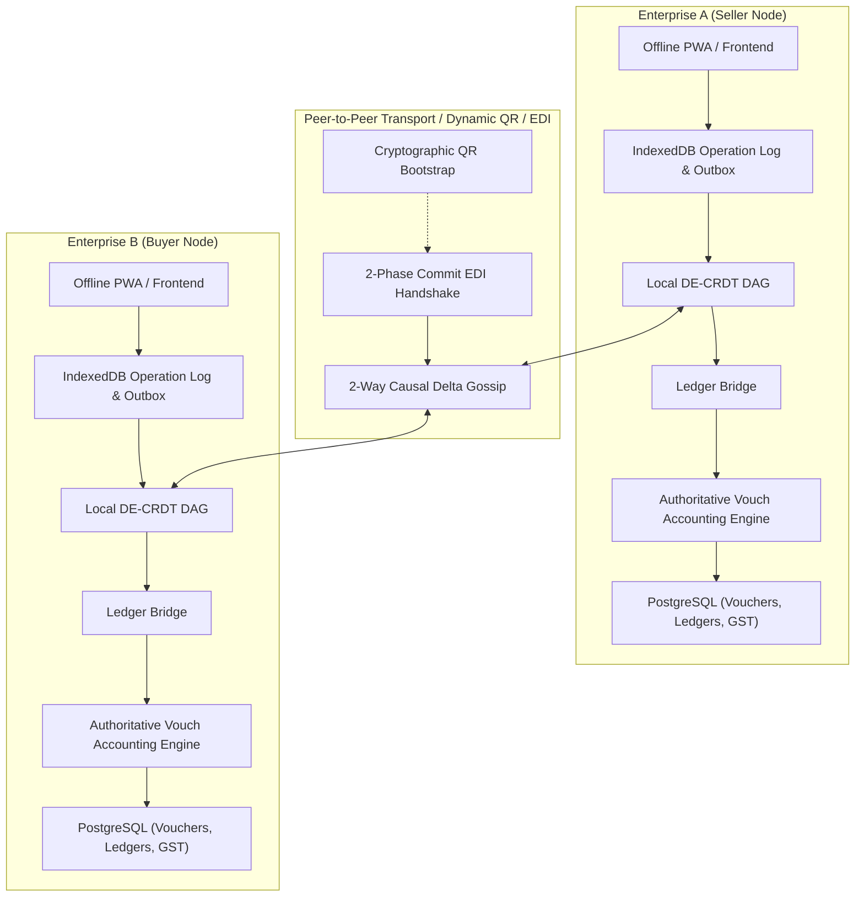
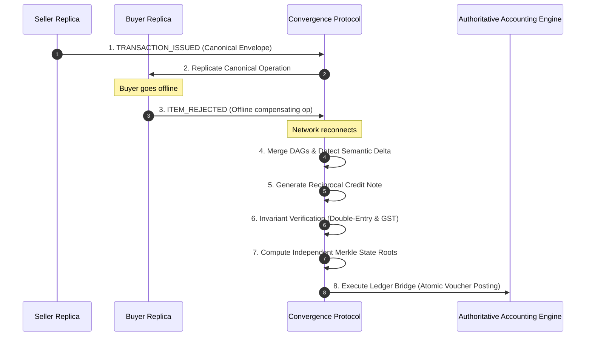

# Patent Specification: System Architecture
**Invention:** Distributed Double-Entry Accounting Synchronization Protocol (DE-CRDT)  
**System Classification:** Distributed Systems / Financial Cryptography / Enterprise Resource Planning (ERP)

---

## 1. High-Level Architectural Model

The architecture decouples consensus and operation replication from local double-entry accounting execution. Unlike conventional monolithic client-server ERP architectures or distributed blockchain ledgers, the present architecture operates as an asynchronous, causally-ordered operation graph where peer enterprises converge mathematically without exposing private internal ledgers.

---

## 2. Component Pipeline & Data Flow

When an inter-enterprise transaction occurs (e.g., an invoice is issued, goods are delivered, items are rejected, or prices are adjusted), the system processes the events through an 8-stage deterministic pipeline:

---

## 3. Core Architectural Modules

### 3.1. Canonical Transaction Envelope (`apps/protocol/schema.py`)
Standardizes invoice headers, line items, tax schedules, and counterparty legal identities into a mathematically normalized format:
$$\mathcal{T} = \langle \text{TxID}, \text{SourceEntity}, \text{DestEntity}, \text{Items}, \text{TaxSummary}, \text{Totals} \rangle$$
Eliminates proprietary database schema mismatches across disparate accounting software.

### 3.2. Causal Operational DAG (`apps/protocol/causal_dag.py`)
Maintains an immutable directed acyclic graph $\mathcal{G} = (V, E)$ of accounting operations where vertices $V$ represent discrete, immutable transitions $\mathcal{O}_i$ and directed edges $E$ represent strict causal dependencies ($\mathcal{O}_j \in \text{parents}(\mathcal{O}_i)$).

### 3.3. Double-Entry CRDT (`apps/protocol/crdt.py`)
Implements a state-based / delta-based join-semilattice over the operational DAG. Guarantees that arbitrary merge interleavings across $N$ nodes converge to the identical state projection without locks.

### 3.4. Semantic Delta & Compensation Engine (`apps/protocol/compensation.py`)
Calculates the multidimensional variance $\Delta$ between buyer and seller states:
$$\Delta = \mathcal{S}_{\text{buyer}} \ominus \mathcal{S}_{\text{seller}}$$
Derives deterministic compensating operations ($\mathcal{O}_{\text{comp}}$) and reciprocal counterparty entries ($\mathcal{O}_{\text{recip}}$), transforming real-world business disputes into mathematically balanced double-entry adjustments.

### 3.5. Authoritative Accounting Ledger Bridge (`apps/protocol/bridge.py`)
The architectural boundary separating distributed consensus from enterprise execution. The protocol never duplicates or replaces accounting calculations. Upon cryptographic commitment, the Ledger Bridge translates converged operations into physical Vouch vouchers (`VoucherService`, `StockService`, `GSTCalculator`), executing atomic double-entry postings with idempotency and rollback guarantees.

### 3.6. 4-Way Merkle State Roots & Cross-Ledger Commitment (`apps/protocol/crypto.py`)
Calculates independent cryptographic summaries for Seller and Buyer subsystems:
$$C_n = H(T_n \parallel O_n \parallel L_{\text{seller}} \parallel I_{\text{seller}} \parallel L_{\text{buyer}} \parallel I_{\text{buyer}} \parallel S_n \parallel B_n \parallel C_{n-1} \parallel V_n)$$
Both counterparties independently counter-sign $C_n$ using Ed25519 digital signatures, establishing non-repudiable proof of synchronized closing balances.
