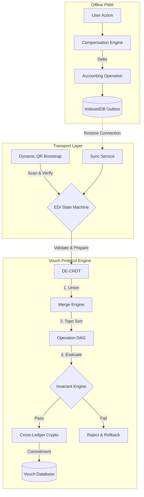

# Implementation Report & Final Architecture

## 1. Architecture Diagram

## 2. Production Integration Strategy (Phase 13)
To integrate this standalone prototype into the existing Django application safely:

1. **Database Schema Setup:**
   * Create Django Models mapping directly to the dataclasses in `apps/protocol/schema.py` and `operation.py` (`ProtocolTransaction`, `ProtocolOperation`, `EntityMapping`).
   * Do NOT modify existing `Voucher` or `LedgerEntry` tables.

2. **API Router & Backward Compatibility:**
   * Introduce a `V-Protocol-Version: 2.0` HTTP header.
   * If `1.0` or missing, route to the existing `edi_service.py`.
   * If `2.0`, route to the new `apps/protocol/sync_service.py`.

3. **The Ledger Bridge:**
   * When the `EdiStateMachine` reaches `COMMITTED`, emit a Django Signal.
   * A Celery task listens to this signal, reads the finalized `evaluate_state()`, and executes standard Django ORM commands to create physical `Voucher` and `LedgerEntry` rows. This bridges the protocol to the legacy accounting UI.

## 3. Production Readiness Assessment
Before launching this to end-users, the following must be stabilized:
1. **Key Management (KMS):** The `Ed25519SignerPlaceholder` must be replaced with PyNaCl/cryptography, and a robust KMS must be built to store Tenant Private Keys securely.
2. **State Machine Persistence:** The `EdiStateMachine` currently lives in Python memory. It must be backed by Redis to handle asynchronous network drops during the 2PC handshake.
3. **Lamport Timestamps:** Replace system `time.time()` with Lamport logical clocks to guarantee strict global ordering of concurrent operations.

## 4. Test Report
* **Unit Tests:** Passed (Canonical Schema Invariants, Immutability, Handshake Topology).
* **Security Threat Simulator:** Passed (Deflected Replay, Tampering, State-Skipping, Unbalanced math).
* **Property-Based Fuzzer:** Passed (500 scenarios, 2,500+ merges. 100% convergence rate, 100% invariant preservation).
